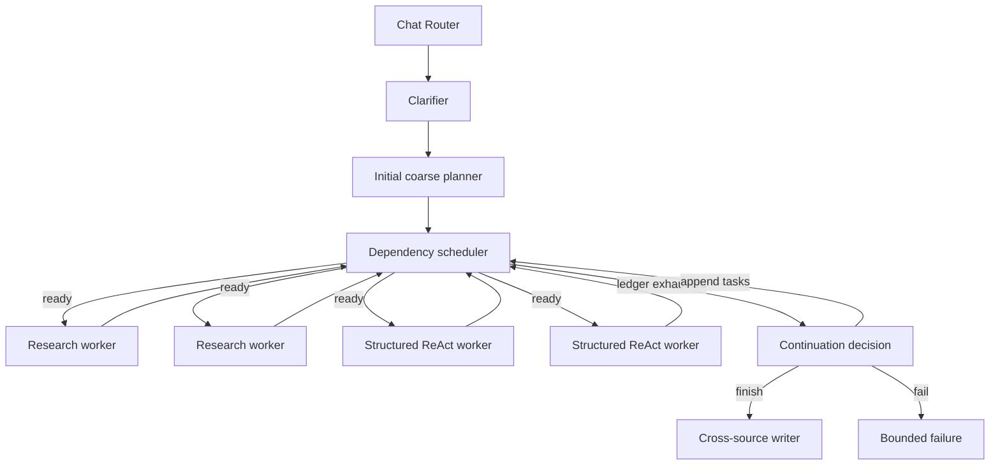

<!--
SPDX-FileCopyrightText: Copyright (c) 2026, NVIDIA CORPORATION & AFFILIATES. All rights reserved.
SPDX-License-Identifier: Apache-2.0
-->

# Hybrid Researcher

Hybrid Research coordinates public/document research with enterprise structured analysis. The catalog-aware Chat
Researcher router selects it after GSF confirms that the request contains supported structured concepts.

## Architecture

The outer workflow is mildly ReAct-style: plan evidence obligations, execute independent work in parallel, observe the
terminal ledger, then append result-driven work or finish. It does not run an LLM supervisor after each task or
dependency level. LangGraph `Send` provides coarse fan-out/fan-in; deterministic Python code handles readiness and
dependency failures.

## Contracts and guards

`HybridTask` has an ID, a kind (`research` or `structured_analysis`), one coherent objective, and optional dependencies.
`HybridTaskPlan` is the initial coarse graph. Each immutable `TaskRun` records one terminal execution result. A
`ContinuationDecision` chooses `finish`, `append`, or `fail`; append preserves every existing task and run.

Operational guards are semantic-neutral:

- at most 12 tasks over the complete run;
- at most four concurrently dispatched tasks;
- at most two appended task waves;
- unique IDs, declared dependencies, and an acyclic graph; and
- no exact duplicate kind/objective/dependency task.

There are no research-versus-structured cardinality rules. A plan may contain multiple independent tasks of either kind,
only one kind, or dependencies in either direction.

## Planning and continuation

A task represents one worker trajectory, not one SQL statement. Independent evidence packages become parallel tasks.
Structured retrieval and pandas work stay in one task when later calls require earlier rows, identifiers, grain, filters,
joins, or calculations.

The initial planner may declare a dependency whose objective is already known. Result-dependent fan-out is deferred: for
example, a structured task can discover several entities, after which continuation appends one research task per returned
entity. Continuation runs only when every current task is succeeded, failed, or blocked. It receives compact conclusions,
limitations, failure metadata, retained provenance, and the remaining budgets. It cannot replace or mutate the ledger.

An attempted append after two extension waves fails closed. A terminal finish/fail decision remains allowed after the
second wave.

## Structured analysis worker

Each `structured_analysis` task invokes one registered, headless ReAct worker. The router's complete catalog response stays
in workflow state; the model sees candidate label, attribute, and term plus `truncated` and `uncovered_entities`. It does
not repeat catalog discovery.

The worker exposes only:

- `query_gsf(question)`, which asks the registered `gsf__text_to_sql` function a natural-language business question,
  retains every complete response/error only for the active worker trajectory, and returns a bounded projection with SQL,
  rows, semantic context, warnings, assumptions, citation identity, and a complete-response manifest; and
- `execute_python(code)`, available only after a successful GSF response, which runs pandas/Python in the existing
  network-blocked `SandboxProvider` against the complete manifest files.

One or two GSF calls are the normal target. Hard limits are four GSF calls and four Python calls. Exact repeated GSF
questions and multiple GSF calls emitted in one model turn are rejected. The total worker deadline is 600 seconds, each
GSF request retains its configured 300-second client deadline, and Python execution is limited to 60 seconds per call.

GSF errors remain analytical observations. Transport failure does not justify semantic rephrasing. An actual response at
the wrong grain, with null/empty rows, omitted dimensions, or conflicting semantic context may justify one materially
corrected follow-up. A worker may return `sufficient`, `limited`, or `insufficient`; executor exceptions, sandbox failures,
and total timeouts create failed task runs.

After its last required GSF or Python call, the worker returns an answer-ready evidence capsule of at most 8,000
characters. The capsule preserves the exact findings, identifiers, comparisons, grain, units, time basis, calculations,
assumptions, warnings, and limitations needed downstream. It does not copy raw rows, SQL, Python code, or Python output.
Complete GSF responses, Python code, and Python output remain worker-local until sandbox cleanup. Before the terminal result
enters workflow state, each GSF outcome is reduced to bounded provenance containing its question, status, request and
citation identity, row count, truncation state, bounded columns and semantic context, assumptions, warnings, or error
metadata. Continuation, dependent workers, checkpoints, task events, and the writer receive only that compact terminal
contract and the answer-ready capsule.

## Research, dependencies, and failure

Research tasks use the focused Hybrid research worker and return complete `ResearchNotes`; GSF tools are excluded. When a
task has dependencies, its worker receives compact dependency conclusions. Only successfully completed dependencies are
dispatched. Failure blocks descendants but does not stop unrelated ready tasks.

The continuation model decides whether limited/failed evidence is adequate, whether a distinct extension can repair it,
or whether the workflow must fail. The public failure remains sanitized.

## Writer and provenance

After a terminal `finish`, one tool-free writer receives the original and clarified objectives, final append-only ledger,
dependency lineage, complete successful research notes, bounded structured conclusions and limitations, bounded GSF
provenance summaries, and resolved conventional sources. It performs no retrieval and no new material calculations.

GSF citation identities and captured research sources are registered with the request-scoped source registry, after which
the existing citation verification and report sanitization run.

## Configuration

The outer `hybrid_research_agent` config selects the clarifier, planner/continuation, writer, research worker, and
structured worker. The registered `structured_analysis_worker` owns its LLM, GSF function, database/row scope, sandbox,
tool limits, and deadline. See [Configuration Reference](../../customization/configuration-reference.md) for every field.

This synchronous implementation retains LangGraph's superstep barrier. Removing it requires a separate asynchronous
runtime and different per-task checkpoint semantics, and is deferred until latency measurements justify that complexity.
